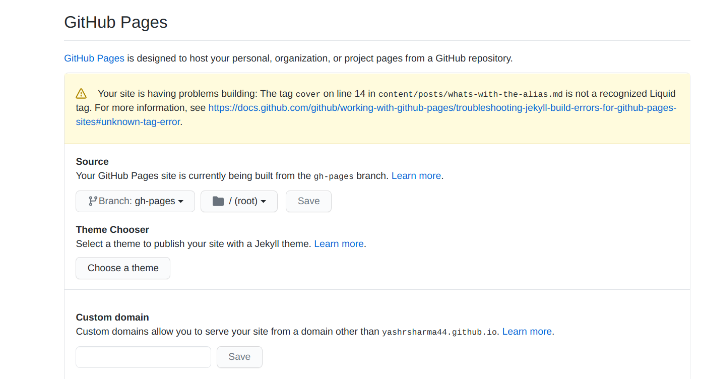

+++
title = "Setting up a new blog"
description = "My experiences on migrating on to a new blog framework"
date = 2020-10-23
path="one-new-blog"
template="page.html"

[taxonomies]
categories = ["tech"]
tags = ["blog", "zola"]
+++


All Hail Xypnox for the theme!


## Migrating to another Blog

For months, I have been planning to shift my blog to a new setup. My previous blog was taken from hugo, which
was functional, but at the same time, it was pretty difficult in managing the UI. I had some ideas for formatting
the blog with some personal touch, but hugo seemed too complex for me to understand. I predominantly don't spend
much time playing with Frontend, so it was difficult for me to work with a complex setup.

Another reason for me was that, I was smitten by the UI of the blog my fellow friend used - [**_xypnox_**](https://www.xypnox.com/blag). I wanted to try out, so I caught up with him and I started porting my blog using his theme. The blog uses **`Zola`** as the static site generator. It is written in _**Rust**_, so its really fast. The best part I found, was
its minimal setup for using it, with minimal fuss. Considering my usecase, this sounded really good - no more complex file structure to decrypt, and users can add in their own functionality without breaking things.

Anyone who wants a detailed review of using the current setup can checkout _**xypnox**'s_ blog-post - [link](https://www.xypnox.com/blag/posts/migrating-to-zola/)

## Installing it as a github page

You would see that I use the domain `github.io` for hosting my blog page. GitHub provides free hosting of a static page
in a single domain. The URL that is alloted is along the lines - `https://<github_id>.github.io`. It is quite easy to set up the codebase for the static webpage, and once you commit your changes, those get reflected automatically.

**GitHub** provides `jekyll` support out of the box, so any static setup written in jekyll would be natively supported. For `Zola`, I used _**GitHub Actions**_ for pushing out changes live as I commited. Zola has documented out the steps quite well, so you can have a look - [link](https://www.getzola.org/documentation/deployment/github-pages/#github-actions)

In case you are migrating from `jekyll`, you might encounter an error -



I managed to solve this using this issue from this [blog](https://github.community/t/how-to-disable-jekyll-build/10981). Basically create a `.nojekyll` file in the root, and the rest is taken care.

Another issue that I encountered was that `Zola` wasn't able to find an empty `sass` folder which was supposed to be
there -

```powershell
Error: Can't watch `sass` for changes in folder `/home/yash/blog`. Do you have correct permissions?
Reason: entity not found
```

Apparently, GitHub doesn't commit empty directories - [https://stackoverflow.com/questions/26079618/why-cant-i-commit-an-empty-folder-in-git](https://stackoverflow.com/questions/26079618/why-cant-i-commit-an-empty-folder-in-git).

So I created a `sass` folder in the root, and the `Zola` was up and running.

## Other changes that I made

I also changed the background color to `#E8F2F7`. It has a nice warm shade which was a change from the author's background color. I also added a social media link at the bottom of the page, which was quite easy to populate. The Dark Mode is an absolute beast, so I didn't tinker with the setup; looks cooler that way.

## Conclusion

I setup the blog in around an hour and 20 minutes for setting up the GitHub Actions. This is quite great, as the structure of the website is clean and minimal, much like the theme. It does have it's shortcomings - I had to populate the disqus links which was hardcoded deep inside the template; would love to have it configured throught `toml` settings. Since its quite an early version of the theme, all these can be worked upon, because it is an Open Source project!
